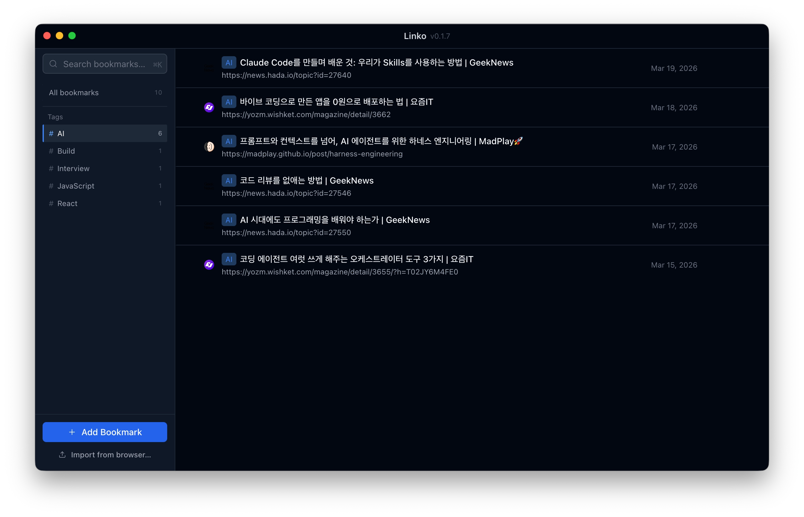

# Linko

A local-first bookmark manager for macOS, built with Electron.



---

## Background

A while back, there was a bookmark management service called **Picurate** ([피큐레잇](https://blog.naver.com/kaiba1004/222500330854)). It had exactly what browser-native bookmarks lack — proper organization, tagging, and search. I used it daily. Then the service shut down.

After that, I tried managing bookmarks in **Notion** — dedicated database, custom properties, the works. That didn't stick either. The friction of opening a browser tab just to save another browser tab never felt right.

So I decided to build my own. A local app. No accounts, no syncing to someone else's server, no service shutdowns. Just a fast, keyboard-friendly tool that lives on my machine and does one thing well.

That's Linko.

---

## Features (v0.1 MVP)

- Add bookmarks with auto-fetched title and favicon
- Edit URL, title, and notes
- Assign and filter by tags
- Full-text search across URL, title, and notes — instant results
- Import bookmarks from browser HTML export (Chrome, Firefox, Safari)
- Open bookmarks in your default browser
- All data stored locally in SQLite — no cloud dependency

---

## Tech Stack

| Layer            | Technology                       |
| ---------------- | -------------------------------- |
| Framework        | Electron                         |
| Frontend         | React + TypeScript               |
| State management | Zustand                          |
| Styling          | Tailwind CSS                     |
| UI primitives    | Radix UI                         |
| Database         | SQLite (via better-sqlite3)      |
| Build            | electron-vite + electron-builder |

---

## Architecture

```
Main Process (Node.js)
  ├── SQLite database (local storage)
  ├── IPC handlers  (src/main/ipc/)
  ├── Repository layer (src/main/db/)
  └── URL metadata fetcher (src/main/services/)

Renderer Process (React)
  └── communicates via IPC only — no direct Node.js access

Shared
  ├── src/shared/types.ts         — shared TypeScript types
  └── src/shared/ipc-channels.ts  — typed IPC channel names
```

The renderer never touches SQLite directly. All data flows through typed IPC channels, which means the storage backend can be swapped (e.g. from local SQLite to a remote API) without touching any UI code.

---

## Getting Started

Requires Node.js 20+. Use pnpm, npm, or yarn.

```bash
# Install dependencies
pnpm install   # or: npm install / yarn install

# Run in development
pnpm dev       # or: npm run dev / yarn dev
```

### Build & Install on macOS

```bash
# Build and package as a DMG installer
pnpm package   # or: npm run package / yarn package
```

This produces a `.dmg` file under `dist/`. To install:

1. Open the `.dmg` file
2. Drag **Linko.app** into the **Applications** folder
3. Launch Linko from Applications or Spotlight

---

## Keyboard Shortcuts

| Action | Shortcut |
| ------ | -------- |
| Open command palette (search) | `⌘K` |
| Add new bookmark | `⌘N` |
| Save bookmark (in modal) | `⌘↵` |
| Close command palette | `Esc` |
| Create tag (in tag input) | `↵` |

---

## Project Structure

```
linko/
├── src/
│   ├── main/          # Electron main process
│   │   ├── index.ts
│   │   ├── preload.ts
│   │   ├── ipc/       # IPC handlers (one file per domain)
│   │   ├── db/        # SQLite schema + repositories
│   │   └── services/  # URL fetcher, importer
│   ├── renderer/      # React app
│   │   ├── components/
│   │   ├── pages/
│   │   ├── hooks/
│   │   └── store/     # Zustand stores
│   └── shared/        # Types and IPC channel names
├── .context/          # Agent collaboration files (see below)
└── CLAUDE.md
```

---

## How This Project Is Built

Linko is being developed almost entirely through **agentic engineering** — multiple specialized AI agents, each owning a specific part of the workflow.

### Agent Roles

| Agent                | Responsibility                                        |
| -------------------- | ----------------------------------------------------- |
| `/agent-pm`          | Requirements, user stories, work scope                |
| `/agent-designer`    | Design system, screen layouts, component specs        |
| `/agent-dev-core`    | Main process, SQLite, IPC handlers                    |
| `/agent-dev-ui`      | React renderer, components, Zustand stores            |
| `/agent-dev-qa`      | Orchestrates 5 parallel QA sub-agents, aggregates results into a unified report |
| `/agent-orchestrate` | Coordinates parallel agent work, resolves conflicts   |

### Parallel Work with Conductor

Claude's Agent Teams feature requires a higher-tier plan. To achieve parallel agent execution on Claude Pro, this project uses **[Conductor](https://docs.conductor.build/)** — a Mac app that runs multiple Claude Code workspaces side by side.

Each task runs in its own isolated Conductor workspace. Workspaces are independent units — there is no shared coordination layer between them. Each workspace operates on its own `.context/` directory (gitignored, local only) as a scratch space for within-session agent handoffs.

### `.context/` — Local Agent Scratch Space

The `.context/` directory is a local-only scratch space for agents within a single workspace session. It is **gitignored** and not shared between team members or workspaces.

```
.context/               ← gitignored, local to each workspace
├── planning/           ← written by /agent-pm, read by designer + dev agents
├── design/             ← written by /agent-designer, read by dev-ui
├── implementation/     ← ipc-api.md written by /agent-dev-core, read by dev-ui
├── patches/            ← contracts + file-ownership for parallel patch work
└── qa/                 ← QA run reports and verification artifacts
```

Because `.context/` is gitignored, its contents do not persist across workspaces or team members — each workspace starts fresh. Agents generate context on demand at the start of each session.

**Agent execution order**:

```
1. /agent-pm          → planning/
2. /agent-designer    → design/
3. /agent-dev-core    → src/main/  +  implementation/ipc-api.md
   /agent-dev-ui      → src/renderer/  (runs in parallel with dev-core)
4. /agent-dev-qa      → spawns 5 sub-agents in parallel → qa/qa-checklist.md
                         ├── security    (Electron security settings)
                         ├── ipc         (channel coverage, response shapes)
                         ├── functional  (CRUD flow traces)
                         ├── build       (electron-vite, electron-builder, tsconfig)
                         └── architecture (repository pattern, import conventions)
```

Steps 3a and 3b can run in parallel because the IPC contract is frozen before both start — each agent knows exactly what interface it is building to or consuming.

Step 4 runs each QA category as a separate sub-agent in parallel (defined in `.claude/agents/qa/`), then the orchestrator aggregates all results into a single report. This reduces QA time from ~4 minutes to roughly the duration of the slowest sub-agent.

### `/git-create-pr` — How PR Creation Works

Calling `/git-create-pr` in any workspace triggers the following sequence automatically:

```
1. Inspect current state
   └── git status + git log origin/main..HEAD

2. Analyze diff
   └── Determine conventional commit type, scope, and summary
       from the actual changes

3. Pre-flight checklist (resolved before PR is created)
   ├── PR title format — validated against regex:
   │     ^(feat|fix|perf|test|docs|refactor|build|ci|chore|revert)(\([a-zA-Z0-9]+\))?!?: [A-Z].+[^.]$
   ├── PR body structure — required sections must all be present:
   │     ## Summary, ## Changes, ## Checklist
   ├── No unchecked items — body must not contain "- [ ]"
   ├── Security review — diff is scanned against all rules in .claude/rules/
   │     (electron-security, renderer-conventions, main-conventions, etc.)
   └── Related issues — gh issue list is checked; Closes #<n> added if relevant

4. Push branch
   └── git push -u origin HEAD  (only if not already pushed)

5. Create PR
   └── gh pr create with verified title, summary, changes list,
       and pre-checked checklist
```

**PR title format** follows [git-conventions.md](.claude/rules/git-conventions.md):

```
<type>(<scope>): <summary>
```

Examples:
```
feat(renderer): Add bookmark search with tag filtering
fix(main): Resolve SQLite connection leak on app quit
docs(shared): Update IPC channel naming conventions
```

All checklist items are verified and marked `[x]` before the PR is opened — not after.

---

## Release Process

Releases are automated with **[Release Please](https://github.com/googleapis/release-please)**.

Every merge to `main` triggers the `release-please` GitHub Actions workflow. It reads the conventional commit history and maintains a **Release PR** that:

- bumps `version` in `package.json`
- updates `CHANGELOG.md` with grouped, linked entries

When the Release PR is merged, a GitHub Release is created automatically with the generated changelog as its body.

### How commits feed into releases

| Commit type | Effect on version |
| ----------- | ----------------- |
| `feat`      | Minor bump (0.x.0) |
| `fix`, `perf` | Patch bump (0.0.x) |
| `feat!` / `BREAKING CHANGE` | Major bump (x.0.0) |
| `chore`, `docs`, `refactor`, `ci` | No version bump |

This means the version is always derived from what actually shipped — no manual version management needed.

---

## License

MIT
